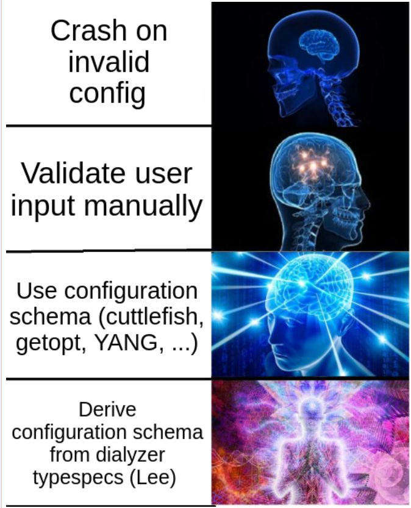

:!sectid:
= Lee

== User stories

- As a power user I want to configure tools without looking into their code.
  I want a useful error message instead of a BEAM dump when I make an error in the config.
  I want documentation about all configurable parameters, their purpose, default value and the type.

- As a software designer I want to focus on the business logic instead of dealing with the boring configuration-related stuff.
  I want to have a `?magic:get(Key)` function that always returns a value that is guaranteed to be safe.

- As a software designer I want to work with native Erlang data types.

There are a few approaches to this conflict:

This library _does_ implement `?magic:get/1` function.

== Features

* Configuration validation (completeness, type safety)
** Type checking uses standard Erlang types, so the type safety guarantees can be extended all the way to the code using the configuration
* CLI arguments parser
* Reading configuration from OS environment variables
* Integration with OTP logger
* Automatic syncing of the configuration with the OTP application environment
* Multiple storage backends for configuration data to choose from:
** persistent term
** mnesia
** regular map
** add your own
* Documentation generation (HTML, manpages, PDF, epub, ...)
** Using Asciidoc or DocBook as input
* Transactional configuration changes
** Configuration patches are validated before taking effect
* Automatic validation of the schema (meta-validation)
* Extensive plugin support (in fact, every feature mentioned above is implemented as a plugin)
* ...All in https://github.com/k32/Lee/blob/master/support/linelimit[less than 3000 lines of code]

== Example model

Get a taste of what Lee configuration specification looks like:

[source,erlang]
----
model() ->
   #{ logging =>
       #{ level =>
            {[value, os_env, cli_param, logger_level],
             #{ oneliner    => "Primary log level"
              , type        => lee_logger:level()
              , default     => notice
              , cli_operand => "log-level"
              }}
        , default_handler_level =>
            {[value, os_env, logger_level],
             #{ oneliner       => "Log level for the default handler"
              , type           => lee_logger:level()
              , default_ref    => [logging, level]
              , logger_handler => default
              }}
        }
   , listener =>
       {[map, cli_action, default_instance],
        #{ oneliner     => "REST API listener"
         , key_elements => [ [id] ]
         , cli_operand  => "listener"
         },
         #{ id =>
              {[value, cli_param],
               #{ oneliner    => "Unique identifier of the listener"
                , type        => atom()
                , default     => local
                , cli_operand => "id"
                , cli_short   => $i
                }}
          , port =>
              {[value, cli_param],
               #{ oneliner    => "Listening interface/port"
                , type        => typerefl:listen_port_ip4()
                , default_str => "0.0.0.0:8017"
                , cli_operand => "port"
                , cli_short   => $p
                }}
          }}
   }.
----

Business logic can access values from this model like this:

[source,erlang]
----
LogLevel = lee:get(?MY_STORAGE, [logging, level]),
%% List listener IDs:
Listeners = lee:list(?MY_STORAGE, [listener, {}]),
%% Get parameters for a listener with ID='local':
{IP, Port} = lee:get(?MY_STORAGE, [listener, {local}, port]),
...
----

where `?MY_STORAGE` is a static term explained later.

Note that this function returns the value straight away, without wrapping it `{ok, ...} | undefined` tuple
because Lee guarantees that the configuration is always complete.

== Schema
=== Type reflections

As advertised, Lee configuration is fully aware of the Dialyzer types.
Lee relies on https://github.com/k32/typerefl[typerefl] library to reify types.

=== Model nodes

Note: we use word "model" as a synonym for "schema" or "specification".

Model is the central concept in Lee.
Lee models are made of two basic building blocks: *namespaces* and *nodes*.
Namespace is a regular Erlang map where keys are atoms and values can be either nodes or other namespaces.

Leaf node is a tuple that looks like this:

[source,erlang]
----
{ MetaTypes      :: [MetaType :: atom()]
, MetaParameters :: #{atom() => term()}
, Children       :: lee:namespace()
}
----

or this:

[source,erlang]
----
{ MetaTypes      :: [atom()]
, MetaParameters :: #{atom() => term()}
}
----

(The latter is just a shortcut where `Children` is an empty map.)

`MetaTypes` is a list of behaviors associated with the node.

=== Metatypes

Metatypes are the meat and potatoes of Lee: they define the behaviors associated with the node.
Every feature, such as type checking or CLI parsing, is handled by one of the metatypes.
Metatypes are defined by the Erlang modules implementing https://github.com/k32/Lee/blob/master/src/framework/lee_metatype.erl:"lee_metatype behavior"
which defines a number of callbacks invoked during different configuration-related workflows.

Example metatypes:

* `value` denotes a configurable value that can be accessed using `lee:get/2` function.
  It defines type and default value.

* `map` denotes that the node is a container for child values.

* `app_env` allows to sync values defined in the Lee schema with the OTP application environment.

* `os_env` reads configurable values from the OS environment variables.

* `cli_param`, `cli_action`, and `cli_positional` read configurable values from the CLI arguments.

* `logger_level` automatically sets logger level.

* `default_instance` automatically creates the default instance of a map.

* ...

And of course users can create custom metatypes.

=== Metaparameters

`MetaParameters` field of the node is map containing arbitrary data relevant to the metatypes assigned to the node.
There are no strict rules about it.
For example, `value` metatype requires `type` metaparameter and optional `default` parameter.

=== Meta-validation

Metatype callback modules validate correctness and consistency of the Lee model itself.
This process is called meta-validation.
For example, `value` metatype checks that value of metaparameter `default` has correct type.

=== Model compilation

Lee models have a nice property: they are composable as long as their keys do not clash, so they can be merged together.

Model modules should be compiled to a machine-friendly form before use using `lee_model:compile/2` function:

[source,erlang]
----
lee_model:compile( [lee:base_metamodel(), lee_metatype:create(lee_cli)]
                 , [Model]
                 )
----

It takes two arguments: the second argument is a list of "raw" models to be merged,
and the first one is a list of terms produced by applying `lee_metatype:create` function to each callback module used by the model.
Most common metatypes such as `value` and `map` are contained in `lee:base_metamodel()` function.

== Data storage

Lee provides an abstraction called `lee_storage` that is used as a container for the runtime configuration data.
Any key-value storage (from proplist to a mnesia table) can serve as a `lee_storage`.
There are a few prepackaged implementations:

- `lee_map_storage` the most basic backend keeping data in a regular map
- `lee_persistent_term_storage` stores data in a persistent term tagged with the specified atom
- `lee_mnesia_storage` uses mnesia as storage, reads are transactional
- `lee_dirty_mnesia_storage` is the same, but reads are dirty (this storage is read-only)

The contents of the storage can be modified via *patches*.
The following example illustrates how to create a new storage and populate it with some data:

[source,erlang]
----
-include_lib("lee/include/lee.hrl").

-define(MY_STORAGE_KEY, my_storage_key).
-define(MY_STORAGE, ?lee_persistent_term_storage(?MY_STORAGE_KEY)).

...

%% Initialization:
%%   Create the model:
{ok, Model} = lee_model:compile(...),
%%   Create am empty storage:
?MY_STORAGE = lee_storage:new(lee_persistent_term_storage, ?MY_STORAGE_KEY),
%% Initialize the config. This will read OS environment variables, CLI
%% arguments, etc. and apply this data to the config storage:
lee:init_config(Model, ?MY_STORAGE),

...

%% Modify configuration in the runtime:
Patch = [ %% Set some values:
          {set, [foo], false}
        , {set, [bar, quux], [quux]}
          %% Delete a value:
        , {rm, [bar, baz]}
        ],
lee:patch(?MY_STORAGE, Patch)
----

`lee:patch` function first applies the patch to a temporary storage, validates its consistency, and only then transfers the data to `?MY_STORAGE`.

== Documentation

Lee helps to generate user manuals using https://docbook.org/:Docbook as an intermediate format.
(You don't have to write any DocBook by hand, though)

In the simplest case, it is possible to embed docstrings directly into the model:

[source,erlang]
----
#{ foo =>
     {[value],
      #{ oneliner => "This value controls fooing" %% Very short description in plain text
       , type     => integer()
       , default  => 41
       %% Long description in DocBook format:
       , doc      => "<para>This is a long and elaborate description of
                      the parameter using docbook markup.</para>
                      <para>It just goes on and on...</para>"
       }}
 }.
----

`oneliner` is a one-sentence summary, and `doc` is a more elaborate description formatted as DocBook.
Lee does the job of assembling an intermediate DocBook file from the fragments.

Also element with `doc_root` metatype containing information about the application itself should be present somewhere in the model:

[source,erlang]
----
#{ '$doc_root' =>
     {[doc_root],
       #{ oneliner  => "An ultimate frobnicator"
        , app_name  => "Frob"
        , doc       => "<para>Long and elaborate description of this
                        tool</para>"
          %% Name of executable:
        , prog_name => "frob"
        }}
 }.
----

(Note: location of doc root node doesn't matter, but there should be one and only one node with `doc_root` metatype).

=== Why DocBook

DocBook is not the most popular or concise markup language, but it was chosen as an intermediate format because of the following properties:

* It's the easiest format to assemble from small fragments
* Erlang has great support for XML out of the box
* It's easy to validate programmatically, thanks to the XML schema
** It's easier to integrate spell checking
* It's whitespace-insensitive.
  Given that the docstrings may come from string literals embedded into Erlang code,
  formatting of the source code should not affect the resulting documents.
  Also it generally focuses on structure rather than representation,
  which is useful for extracting a diverse range of formats from HTML to manpage.

=== Asciidoc

Embedding documentation into code as XML works in simple cases, but it doesn't scale well.
In a large project it's preferable to keep documentation separate, and use a less verbose format.

Lee supports <<https://docs.asciidoctor.org/asciidoc/latest/,AsciiDoc>> as an alternative format.
<<https://github.com/k32/Lee/blob/master/src/framework/lee_asciidoc.erl,lee_asciidoctor>> module allows to "enrich" the model with the docstrings extracted from an external source,
see <<https://github.com/k32/Lee/blob/master/doc/src/schema.adoc,example>>.

=== Export

The job of `lee_doc` module is to produce a docbook XML file.
This can be done with XSLT stylesheets:

* https://docbook.org/tools/
  Note: many Linux distributions make these stylesheets available in the repositories.
  For example, in Ubuntu the package is called `docbook-xsl`.

* https://xsltng.docbook.org
  XSLTNG can create very fancy static HTML webpages.

<<blob/master/Makefile,Makefile>> gives an example of how to integrate these tools into the build flow.

== Name?

This library is named after Tsung-Dao Lee, a physicist who predicted P-symmetry violation together with Chen-Ning Yang.

== Design goals
=== Speed

TL;DR: getting values from config should be very fast, but updating and validating config may be slow.
It should be possible to use `lee:get` function in hotspots.
